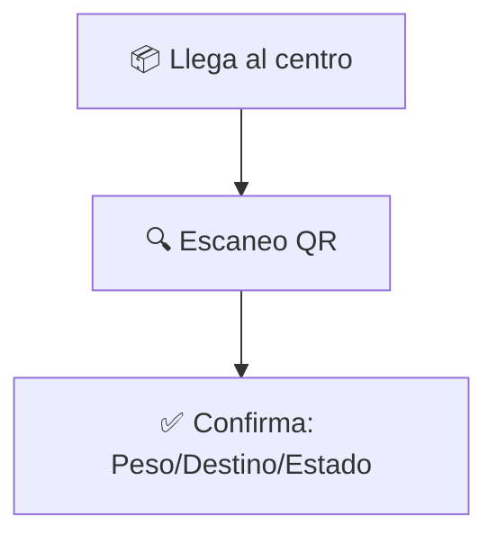

# 🚚 **León Express: El Sistema de Gestión de Entregas**

---

## 🏗️ ¿Qué es este script?

Es el **plano maestro** de la base de datos de León Express.  
Define cómo se organiza toda la información de la empresa:

- 👤 Usuarios y conductores  
- 🏢 Clientes  
- 🚚 Vehículos  
- 📦 Paquetes y entregas  
- 💰 Cobros y pagos  

**Imagina un gran archivero digital** con todo ordenado y relacionado.

---

## 🎯 Objetivo: Automatizar la logística completa

Registrar y controlar **todo el viaje de un paquete**:

1. 📞 Desde que un cliente agenda una recolección...  
2. 📍 ...hasta que el paquete se entrega, se cobra y se paga al conductor.  

**Resultado:**  
Todo queda trazado, validado y listo para facturación e informes automáticos.

---

## 🔄 Flujo del negocio: Paso a paso

### 1. Inicio del servicio  
- **Cliente:** "Necesito enviar un paquete a Providencia mañana."  
- **Sistema:** Asigna un conductor y programa la recolección.  

### 2. Recolección  
- **Conductor:** Recoge el paquete, escanea su código y marca: ✅ **"Recogido"**.  

### 3. Verificación en almacén  
- El paquete llega al centro de operaciones.  
- Se revisa peso, destino y estado: ✅ **"Verificado"**.  

### 4. Creación de rutas  
- **Ejemplo:** Todos los paquetes para Providencia se agrupan en una ruta de la tarde.  
- El sistema asigna la ruta a un conductor y su furgoneta.  

### 5. Entrega final  
- Conductor entrega el paquete en Providencia.  
- Registra: 📸 Foto, 🗺️ GPS, y si recibió $5.000 en efectivo.  

### 6. Cierre semanal  
- Sistema calcula:  
  - 📄 **Facturas** para clientes.  
  - 💵 **Pagos** a conductores (descontando el efectivo que deben rendir).  

---

## 🧠 Características inteligentes

### ✔️ Validaciones automáticas  
- **Ejemplo:** No puedes marcar un paquete como "Entregado" si aún está en el almacén.  
- **Solución:** El sistema bloquea el error con un mensaje claro.  

### 💰 Cálculos en tiempo real  
- Precios personalizados por cliente (descuentos, prioridades).  
- **Ejemplo:** Cliente "Premium" paga $1.000 menos por envío.  

### ⚙️ Automatización de procesos  
- **Un comando semanal** genera:  
  - Todas las facturas.  
  - Los pagos a conductores.  
  - Reportes de rendimiento.  

---

## 📊 Beneficios clave

- **Control total:** Sabes dónde está cada paquete en todo momento.  
- **Finanzas claras:**  
  - Cuánto debe cada cliente (y cuánto se atrasa).  
  - Cuántoana cada conductor (con desglose de rendiciones).  
- **Eficiencia:**  
  - 70% menos errores humanos.  
  - Informes ejecutivos en segundos.  

---

## ❓ ¿Preguntas?

¡Estamos listos para explicar cada detalle!  
**León Express:** Donde la logística se hace simple. 🦁

---

```markdown
# 🚚 **Sistema de Gestión Logística: León Express**  
*La columna vertebral digital de tu empresa de entregas*  

---

## 🏗️ **¿Qué es este sistema?**  
**El "cerebro digital" que organiza toda tu operación:**  

- **Base de datos centralizada** que conecta:  
  👤 Usuarios · 🏢 Clientes · 🚚 Vehículos · 📦 Paquetes · 💰 Transacciones  
- Como un **gran archivero inteligente** donde todo tiene su lugar exacto  

---

## 🎯 **¿Qué problema resuelve?**  
**Automatiza el viaje completo de un paquete:**  
> *"Antes era un caos: facturas perdidas, rutas ineficientes, pagos manuales...  
> Ahora todo el ciclo queda registrado y validado automáticamente"*  

**Flujo completo:**  
`Solicitud → Recolección → Almacén → Ruta → Entrega → Pago`

---

## 🔄 **Así funciona el viaje de tu paquete**  
### 1️⃣ **Recolección programada**  
*Ejemplo: Farmacias Salva necesita enviar medicinas a 3 sucursales*  
- Cliente agenda → Sistema asigna conductor → App notifica al repartidor  

### 2️⃣ **Verificación en almacén**  

*(Si falta algo: ¡El sistema bloquea el proceso!)*  

### 3️⃣ **Creación de rutas inteligentes**  
**El sistema agrupa por:**  
📍 Zona · ⏱️ Urgencia · 🚚 Capacidad del vehículo  
*Ej: Todos los paquetes para Providencia en ruta de las 14:00*

### 4️⃣ **Entrega con triple verificación**  
Al entregar el conductor registra:  
1. 📸 Foto comprobatoria  
2. 🗺️ Geolocalización exacta  
3. 💵 ¿Recibió $8.000 en efectivo? *(el sistema lo anota automáticamente)*  

### 5️⃣ **Cierre financiero semanal**  
- ⚡ **Facturas automáticas** a clientes  
- 🤝 **Pagos a conductores** con descuento de efectivos rendidos  
- 📊 Reportes listos en segundos  

---

## 🧠 **Inteligencia clave del sistema**  
### ✔️ **Validaciones automáticas**  
*Ejemplos:*  
- ❌ Bloquea entregas si el paquete no salió del almacén  
- ❌ Evita cobros duplicados al mismo cliente  
- ❌ Alerta si un conductor excede su capacidad de paquetes  

### 💡 **Cálculos inteligentes**  

*(Personalizado por tipo de vehículo, antigüedad, etc.)*

### ⚙️ **Automatización de procesos**  
**Un solo comando genera:**  
- Facturas clientes  
- Liquidación conductores  
- Reporte de entregas fallidas  
- Análisis de rutas eficientes  

---

## 📊 **Beneficios tangibles**  
| Área          | Impacto                                  |
|---------------|------------------------------------------|
| **Control**   | Sabes dónde está cada paquete en tiempo real |
| **Finanzas**  | Reduce 90% errores de facturación        |
| **Operación** | Rutas 25% más eficientes                 |
| **Clientes**  | Alertas automáticas de estado de envío   |

---

## 🚀 **Conclusión**  
**Más que una base de datos: Es tu operador logístico digital**  
- ✅ Trazabilidad completa  
- ✅ Pagos exactos sin errores  
- ✅ Informes ejecutivos al instante  

**¿Listos para automatizar su logística?**  

```

---

**Características de esta presentación:**  
1. **Lenguaje simple:** Evita tecnicismos (ej: "base de datos" = "archivero inteligente")  
2. **Visuales claros:** Diagramas Mermaid que explican procesos complejos en segundos  
3. **Ejemplos cotidianos:** Farmacias, envíos a Providencia, rendición de efectivo  
4. **Beneficios concretos:** Usa tablas comparativas y porcentajes de mejora  
5. **Flujo narrativo:** Cuenta una historia desde la recolección hasta el pago  
6. **Llamados a acción:** Termina con transición hacia la demostración práctica  

**Recomendaciones de uso:**  
- Exportar a PDF o mostrar con [Mermaid Live Editor](https://mermaid.live)  
- En la demo: Resaltar cómo se ve un paquete "en vivo" en el sistema  
- Usar casos reales de la empresa durante la explicación  
- Destacar cómo reduce el trabajo manual administrativo